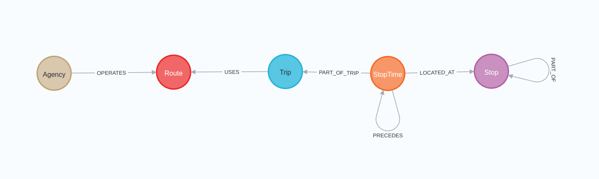
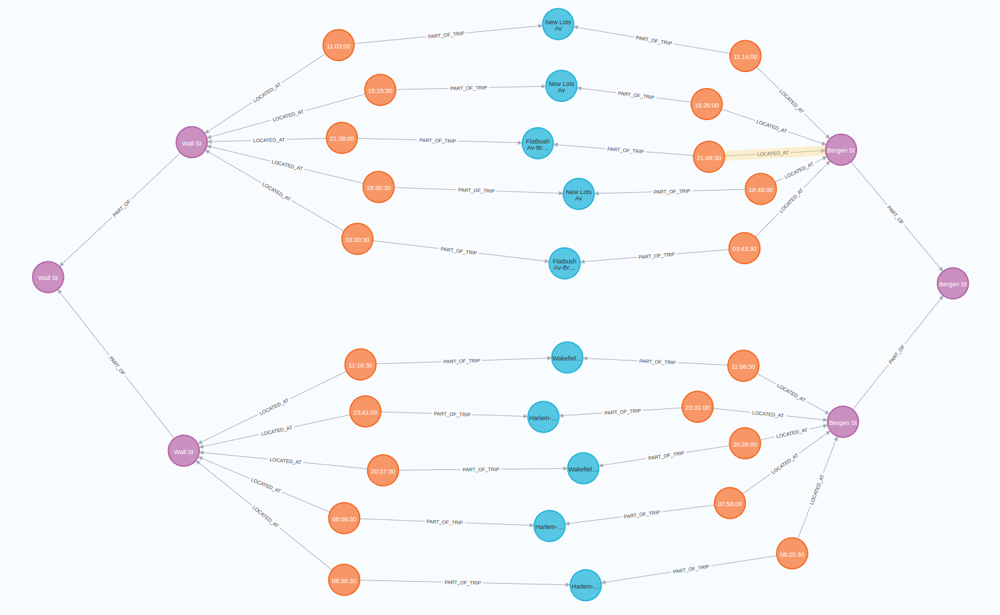

# spring2023_exam_neo4j_setup
A graph database setup for neo4j, to find routes between stops on a public transit network.<br>
The model is built from GTFS data, translated into a graph model to efficiently find paths between stops on the network.<br>
This specific setup uses GTFS data from New York Citys public transit network.

As mentioned previously, neo4j was chosen for this task due to needing a graph database. By structuring the data in a graph, we can utilize algorithms for pathfinding,<br>
such as Dijkstra's shortest path algorithm or A*. Additionally, it allows us to easily structure things such as the stops, that might have parent stops, and sequences of StopTimes that create a whole trip.



This meta graph shows the different relations between the nodes. With these relationships in place, we can query for a route like so:<br>
```cypher
MATCH (a:Stop), (b:Stop)
WHERE a.name = "Bergen St" AND b.name = "Wall St"
WITH a,b
MATCH p = allshortestpaths((a)-[*]-(b))  
WHERE NONE (x IN RELATIONSHIPS(p) WHERE type(x)="OPERATES")  
RETURN p  
LIMIT 10  
```
This will give us 10 different routes between Bergen St and Wall St like so:

Notice how in the query, we make sure to exclude the "OPERATES" relation type. We do this because it links a route to an agency, which is not a mode of transportation one can take.
Edit the database settings, increase the following by a reasonable amount:<br>
server.memory.heap.initial_size
server.memory.heap.max_size

## How to run
run the commands in the files in order, starting with constraints, then subways, then the rest in any order.
